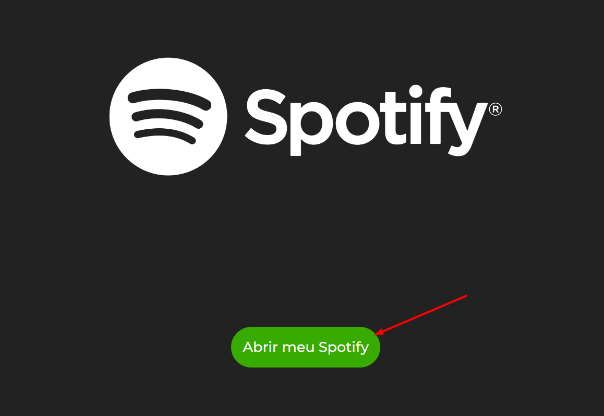
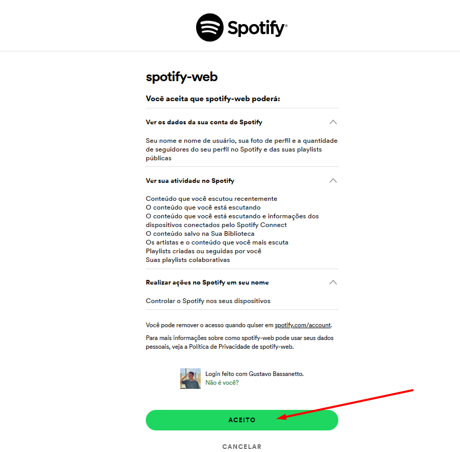
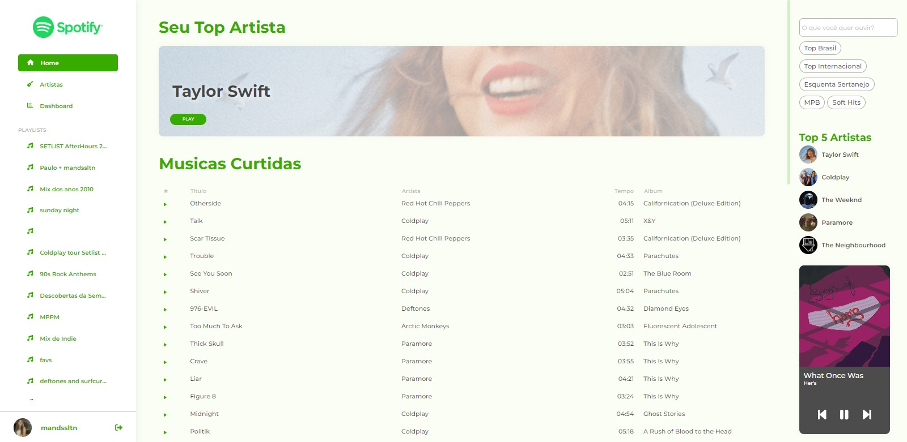

# Spotify
## Versão: 1.0
## Status do Projeto: ⚠️ Espera

## Tópicos
🔹 [Descrição do projeto](https://github.com/Bassanetto/spotify-web#descricao-do-projeto)

🔹 [Funcionalidades](https://github.com/Bassanetto/spotify-web#funcionalidades)

🔹 [Distribuição](https://github.com/Bassanetto/spotify-web#distribuicao)

🔹 [Pré-requisitos](https://github.com/Bassanetto/spotify-web#pré-requisitos)

🔹 [Como rodar a aplicação](https://github.com/Bassanetto/spotify-web#como-rodar-a-aplicacao)

🔹 [Testes realizados](https://github.com/Bassanetto/spotify-web#testes-realizados)

🔹 [Banco de Dados](https://github.com/Bassanetto/spotify-web#banco-de-dados)

🔹 [Linguagens, dependências e libs utilizadas](https://github.com/Bassanetto/spotify-web#linguagens-dependencias-e-libs-utilizadas)

🔹 [Resolvendo problemas](https://github.com/Bassanetto/spotify-web#resolvendo-problemas)

🔹 [Recursos inseridos](https://github.com/Bassanetto/spotify-web#recursos-inseridos)

🔹 [Desenvolvedores/Contribuintes](https://github.com/Bassanetto/spotify-web#desenvolvedores/contribuintes)

🔹 [Informações Extras](https://github.com/Bassanetto/spotify-web#informacoes-extras)

# Descrição do projeto
O projeto inovador que propomos busca aprimorar a experiência do usuário no aplicativo Spotify por meio de um redesign cuidadosamente planejado. A proposta envolve a integração da API do Spotify para potencializar a personalização e a interação do usuário com a plataforma musical. Através dessa integração, os usuários terão acesso a recursos avançados, como, informações detalhadas sobre artistas e álbuns, e a capacidade de compartilhar suas músicas favoritas diretamente do aplicativo.

Este projeto vai além da simples estética visual, priorizando a usabilidade e a funcionalidade. Ao redesenhar a interface, pretendemos simplificar a navegação, tornando a descoberta de novas músicas mais intuitiva. A combinação do design renovado com a potência da API do Spotify promete oferecer aos usuários uma experiência musical mais rica e personalizada, redefinindo a forma como eles interagem com a vasta biblioteca de músicas disponíveis na plataforma. Este projeto representa um passo audacioso em direção a um Spotify mais envolvente, adaptado aos gostos individuais de cada usuário.

## Funcionalidades ⚙️
✔️ Integração com o PowerBI

✔️ Reprodução de Musícas

✔️ Buscas Recentes

✔️ Top 5 Artistas

✔️ Artistas

✔️ Playlists do Usuário

## Distribuição
Link para teste da versão disponibilizada.

## Pré-requisitos ⚠️
Aparelho utilizado para testes:
- Notebook Windows

- ### Dependencias
  - Angular 16
  - TypeScript 4.9
  - FortAwesome
  - PrimeNG

## Como rodar a aplicação
Execute `ng serve` para um servidor de desenvolvimento. Após isso acesse http://localhost:4200/login

## Testes realizados

`1. Realize o Login `
`2. Aceite os termos de Uso`
`3. Após aceitar os termos de uso a tela acima deverá aparecer`

## Linguagens, dependencias e libs utilizadas 📚

## Resolvendo Problemas
 - **Erro de Dependência**
   - Foi necessário mudar a versão do **Angular** e do **TypeScript** para corrigir o problema
 - **Problemas com requisção de dados**
   - No desenvolvimento do projeto enfrentamos problemas com requisição. Para resolver foi necessário utilizar uma tarefa assincrona chamada `await`
 - **Problemas no desenvolvimento do dashboard**
   - Para realizar o dashboard, foi necessário requisitar uma planilha de dados do proprio spotify. Mas, para isso tivemos que esperar em torno de uma semana. Após o recebimento dos dados foi um pouco complicado dar sequência por conta da alta quantidade de dados

## Recursos de inseridos 🧰
Se for o caso, liste tarefas/funcionalidades que ainda precisam ser implementadas na sua aplicação, insira fotos da tela do app.

📝 Spotify :: Correção da tab de pesquisa

📝 Spotify :: Correção do Firebase

## Desenvolvedores/Contribuintes:
- **Participantes**
  - Amanda Lopes Tenor
  - Eduardo dos Santos Camargo
  - Gustavo De Almeida Bassanetto
  - Luiz Gustavo Obara da Silva

## Licença
The MIT License (MIT)

## Copyright ©️ 2023 - Spotify
